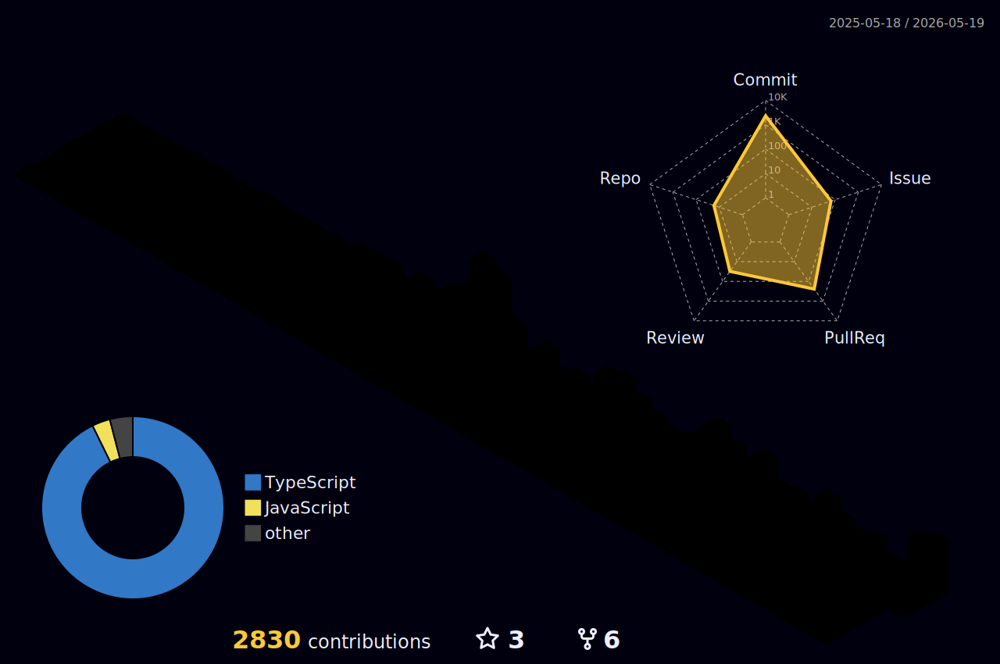

<h1 align="center">Hi 👋, I'm Jeong Ha seung</h1>

- 🔭 I’m currently working on [제로원 - 스터디 플랫폼 서비스](https://www.zeroone.it.kr) / [Github](https://github.com/code-zero-to-one/study-platform-client)

- 📝 I regularly write articles on [https://haseungdev.hashnode.dev/](https://haseungdev.hashnode.dev/)

- 📫 How to reach me **gktmd653@gmail.com**

<h3 align="left">Connect with me:</h3>

<h3 align="left">Languages and Tools:</h3>

        

<h3 align="left">Recent Posts</h3>

- [브라우저에서 입력 제어하기](https://haseungdev.hashnode.dev/input-number-validation-frontend-debugging)

- [tailwind-merge에서 클래스네임은 어떻게 제어되는가?](https://haseungdev.hashnode.dev/tailwind-merge)

